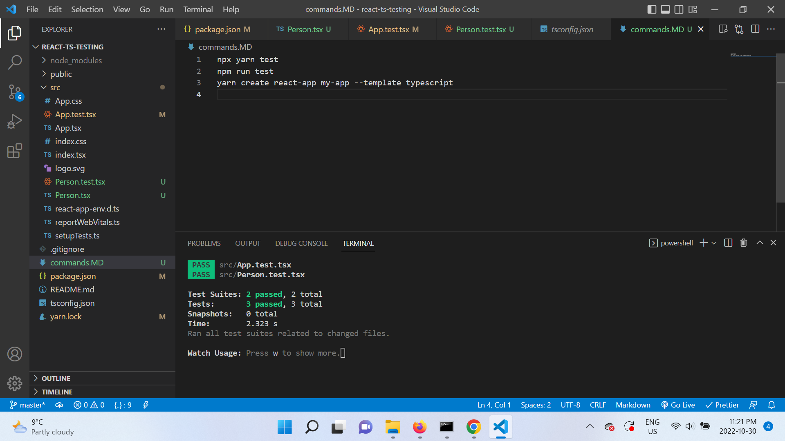

## commands
```
yarn add package-name
yarn add pakcage-name --dev
yarn create react-app my-app --template typescript
yarn test
```

## tools

- Typescript
- React + Redux
- jest + @testing-library/react

## tested

- value-based elemnt, e.g <CustomCompnent />
- intrinsic element , e.g <div >
- hooks, e.g. setState
- test async API call
- custom hook
- Redux
- ...

## Proofs


