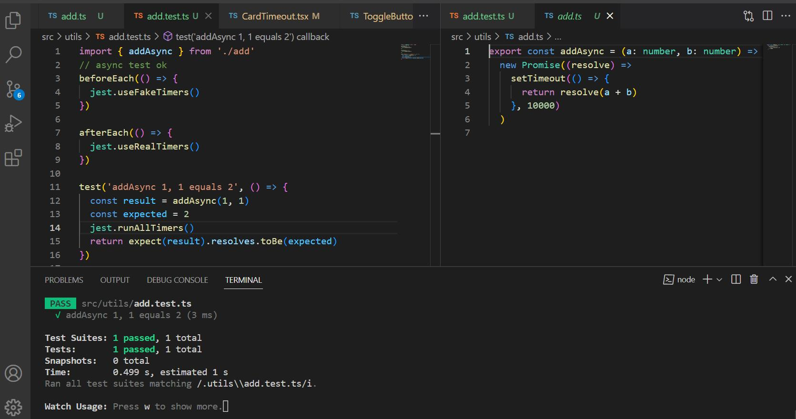

## setup test environment

- install the same versions
- yarn install

## commands

`yarn add package-name yarn add pakcage-name --dev yarn create react-app my-app --template typescript yarn test yarn test -- ./LoginForm.test.tsx`

skipping test with test.skip
`test.skip('some description', ()=>{})`

when a test fail, try using test.only
`test.only('...',()=>{})`

restore references
`jest.spyOn() ... jest.restoreAllMocks()`
mockImplementation is global, so we should restore the previous implementation
`Math.abs = jest.spyOn(Math,'abs').mockImplementation((x)=>x+1) ... ... Math.abs.mockRestore()`

## tools

- Typescript
- React + Redux
- jest + @testing-library/react

## tested

- value-based elemnt, e.g <CustomCompnent />
- intrinsic element , e.g 

- hooks, e.g. setState
- test async API call
- test async Function call
- custom hook
- Redux
- todo HTML elements: select, checkbox,
- Test login form
- ...

## Proofs

## References

[1. fake timers](https://onestepcode.com/testing-library-user-event-with-fake-timers)
